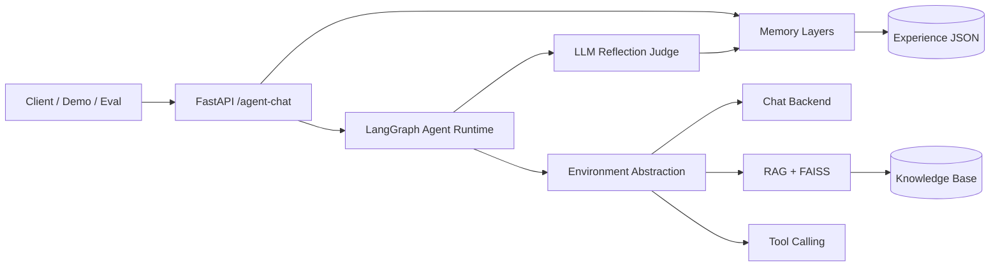
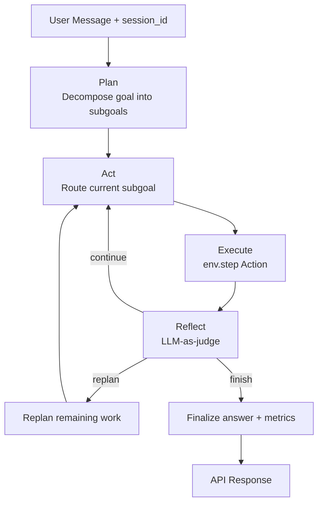

# Overseas-Student-AI-Agent

A production-oriented **LLM Agent runtime** for international student support.

Built with **FastAPI + LangChain + LangGraph + FAISS + Gemini**, featuring:

- Hierarchical planning (`plan -> act -> execute -> reflect`)
- Observation-Action environment abstraction
- Layered memory (working / experience / world knowledge)
- LLM-as-judge reflection with guarded fallback
- Tool calling + RAG + explainable routing
- Trace-level observability and evaluation suites

## Architecture

### High-level system



### Agent decision loop



### Memory layers

| Layer | Role | Storage |
|---|---|---|
| Working memory | Recent conversation turns | In-process by `session_id` |
| Experience memory | Task lessons for future planning | `data/memory/experiences.json` |
| World knowledge | Policies/checklists/facts | `data/knowledge_base` + FAISS |

## Project Structure

```text
backend/
  app/
    main.py            # FastAPI endpoints
    graph_service.py   # LangGraph plan-act-reflect runtime
    environment.py     # Observation-Action environment interface
    memory_service.py  # Working + experience memory
    chat_service.py    # Direct chat
    rag_service.py     # RAG + FAISS retrieval
    tool_service.py    # Tool calling
    logging_service.py # TRACE/INFO logging
    retry_service.py   # Gemini retry/backoff
    schemas.py         # Request/response models
    config.py          # Settings
  demo/
    agent_demo.py      # Interview-ready demo runner
  eval/
    route_eval.py      # Route accuracy evaluation
    task_eval.py       # Task success / steps / tools evaluation
data/
  knowledge_base/      # World knowledge markdown
  memory/              # Experience memory artifacts
```

## Setup

```powershell
cd backend
python -m venv .venv
.\.venv\Scripts\Activate.ps1
pip install -r requirements.txt
```

Create `.env` in the project root (copy from `.env.example`):

```text
GOOGLE_API_KEY=your_real_google_ai_studio_api_key
GEMINI_MODEL=gemini-2.5-flash
GEMINI_EMBEDDING_MODEL=models/gemini-embedding-001
MEMORY_MAX_TURNS=6
RETRY_MAX_ATTEMPTS=3
RETRY_INITIAL_SECONDS=1.0
RETRY_MAX_SECONDS=8.0
LOG_LEVEL=INFO
MAX_PLAN_STEPS=4
EXPERIENCE_MEMORY_MAX_ITEMS=200
EXPERIENCE_MEMORY_TOP_K=3
EXPERIENCE_MEMORY_MIN_SCORE=0.2
EXPERIENCE_MEMORY_ENABLED=true
```

API key: https://aistudio.google.com/app/apikey

## Run the API

```powershell
cd backend
python -m uvicorn app.main:app --reload
```

Docs: http://127.0.0.1:8000/docs

Main endpoint: `POST /agent-chat`

Also available:

- `POST /chat`
- `POST /rag-chat`
- `POST /tool-chat`
- `GET /health`

## 60-second Demo

Start the API, then run:

```powershell
cd backend
python demo/agent_demo.py --base-url http://127.0.0.1:8000
```

The demo walks through 3 scenarios:

1. **RAG**: USYD pre-arrival checklist  
2. **Tool**: weekly budget estimation  
3. **Multi-step**: arrival prep + budget in one request  

It prints for each case:

- `trace_id`
- plan / subgoals
- step routes and rewards
- reflection (`judge_source`, `goal_achieved`, lesson)
- metrics (`steps_used`, `tool_calls`, `memory_hits`, rewards)
- environment action space

Optional flags:

```powershell
python demo/agent_demo.py --base-url http://127.0.0.1:8000 --session-id demo-interview-001
python demo/agent_demo.py --persist-experience false
```

### Manual demo request

```json
{
  "message": "Help me prepare for USYD arrival and estimate weekly budget if rent is 420 AUD.",
  "session_id": "demo-001"
}
```

Useful headers:

- `x-trace-id: demo-multi-001`
- `x-persist-experience: false` (for eval/demo without writing memory)

## Agent Response Highlights

`/agent-chat` returns:

- `plan`: goal + subgoals
- `steps`: per-step route/action/reward/tools
- `reflection`: LLM judge result (`continue/replan/finish`, lesson, `goal_achieved`)
- `metrics`: steps, tool calls, replan flag, memory hits, rewards
- `memory_lessons`: retrieved experience lessons
- `environment`: `{ name, action_space }`
- `sources` / `retrieved_contexts`: RAG explainability
- `used_tools`: executed tools

## Core Capabilities

### Hierarchical planning
- Runtime: `plan -> act -> execute -> reflect (-> replan) -> finalize`
- Simple intents stay single-step; complex intents expand to multiple subgoals
- Cap with `MAX_PLAN_STEPS`

### Environment abstraction
- Unified Observation-Action interface in `environment.py`
- Current adapter: `student_support` (`chat` / `rag` / `tool`)
- Step rewards exposed as `last_reward` / `total_reward`

### Reflection
- LLM-as-judge for progress and next action
- Hard guards + rule fallback for reliability
- Actionable lessons written into experience memory

### Memory
- Working memory by `session_id`
- Experience memory persistence + retrieval for planning
- World knowledge via FAISS RAG
- Eval/demo sessions can disable writes (`x-persist-experience: false`)

### Observability
- Structured logs with `trace_id`
- Set `LOG_LEVEL=TRACE` for routing/planning/reflection traces

### Reliability
- Exponential backoff retries for transient Gemini errors

## Evaluation

### Route evaluation

```powershell
cd backend
python eval/route_eval.py --base-url http://127.0.0.1:8000
```

Reports:

- `eval/reports/route-eval-<timestamp>.json`
- `eval/reports/latest.json`

### Task evaluation

```powershell
cd backend
python eval/task_eval.py --base-url http://127.0.0.1:8000
```

Metrics:

- task success rate
- avg steps / tool calls
- replan rate
- reflection finish rate
- memory hit rate

Reports:

- `eval/reports/task-eval-<timestamp>.json`
- `eval/reports/task-latest.json`

## Interview Talking Points

1. **Agent runtime, not just chatbot**: hierarchical planning + reflection loop  
2. **Environment decoupling**: policy decides Action, environment executes step  
3. **Memory that learns**: experience lessons affect future planning  
4. **Metric-driven iteration**: route eval + task eval close the improvement loop  
5. **Production hygiene**: retries, tracing, eval isolation from memory writes  
