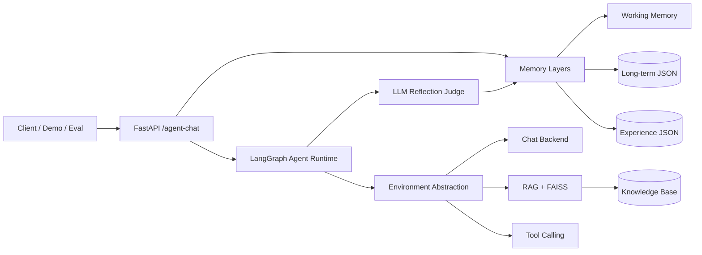
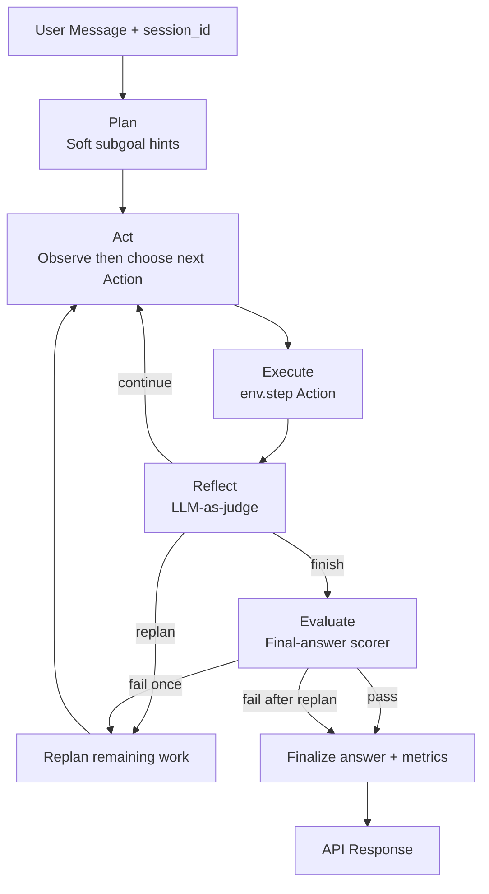

# Overseas-Student-AI-Agent

**English** | [中文](./README.zh-CN.md)

A production-oriented **LLM Agent runtime** for international student support.

Built with **FastAPI + LangChain + LangGraph + FAISS + Gemini**, featuring:

- Hierarchical planning + dynamic Observation→Action loop
- Observation-Action environment abstraction
- Layered memory (working / long-term / experience) with read/write traces
- World knowledge via RAG (separate from agent memory)
- LLM-as-judge reflection with guarded fallback
- Tool calling + RAG + explainable routing
- Trace-level observability and evaluation suites

## Architecture

### High-level system



### Agent decision loop



### Memory layers

| Layer | Role | Storage |
|---|---|---|
| Working memory | Recent conversation turns | In-process by `session_id` |
| Long-term memory | Durable student profile/constraints | `data/memory/long_term.json` |
| Experience memory | Task lessons for future planning | `data/memory/experiences.json` |
| World knowledge | Policies/checklists/facts | `data/knowledge_base` + FAISS |

## Project Structure

```text
backend/
  app/
    main.py            # FastAPI endpoints
    graph_service.py   # LangGraph plan-act-reflect-evaluate runtime
    environment.py     # Observation-Action environment interface
    evaluator_service.py # Final-answer scoring + pass/fail
    memory_service.py  # Working + long-term + experience memory
    chat_service.py    # Direct chat
    rag_service.py     # RAG + FAISS retrieval
    tool_service.py    # Tool calling
    logging_service.py # TRACE/INFO logging
    retry_service.py   # Gemini retry/backoff
    schemas.py         # Request/response models
    config.py          # Settings
  demo/
    agent_demo.py      # Demo runner
  eval/
    route_eval.py      # Route accuracy evaluation
    task_eval.py       # Task success / steps / tools evaluation
data/
  knowledge_base/      # World knowledge markdown
  memory/              # Long-term + experience memory artifacts
```

## Setup

```powershell
cd backend
python -m venv .venv
.\.venv\Scripts\Activate.ps1
pip install -r requirements.txt
```

Create `.env` in the project root (copy from `.env.example`):

```text
GOOGLE_API_KEY=your_real_google_ai_studio_api_key
GEMINI_MODEL=gemini-2.5-flash
GEMINI_EMBEDDING_MODEL=models/gemini-embedding-001
MEMORY_MAX_TURNS=6
RETRY_MAX_ATTEMPTS=3
RETRY_INITIAL_SECONDS=1.0
RETRY_MAX_SECONDS=8.0
LOG_LEVEL=INFO
MAX_PLAN_STEPS=4
EXPERIENCE_MEMORY_MAX_ITEMS=200
EXPERIENCE_MEMORY_TOP_K=3
EXPERIENCE_MEMORY_MIN_SCORE=0.2
EXPERIENCE_MEMORY_ENABLED=true
EVALUATION_PASS_SCORE=0.6
```

API key: https://aistudio.google.com/app/apikey

## Run the API

```powershell
cd backend
python -m uvicorn app.main:app --reload
```

Docs: http://127.0.0.1:8000/docs

Main endpoint: `POST /agent-chat`

Also available:

- `POST /chat`
- `POST /rag-chat`
- `POST /tool-chat`
- `GET /health`

## 60-second Demo

Start the API, then run:

```powershell
cd backend
python demo/agent_demo.py --base-url http://127.0.0.1:8000
```

The demo walks through 3 scenarios:

1. **RAG**: USYD pre-arrival checklist  
2. **Tool**: weekly budget estimation  
3. **Multi-step**: arrival prep + budget in one request  

It prints for each case:

- `trace_id`
- plan / subgoals
- step routes and rewards
- reflection (`judge_source`, `goal_achieved`, lesson)
- evaluation (`score`, `passed`, `feedback`, `triggered_replan`)
- metrics (`steps_used`, `tool_calls`, `memory_hits`, rewards)
- environment action space

Optional flags:

```powershell
python demo/agent_demo.py --base-url http://127.0.0.1:8000 --session-id demo-interview-001
python demo/agent_demo.py --persist-experience false
```

### Manual demo request

```json
{
  "message": "Help me prepare for USYD arrival and estimate weekly budget if rent is 420 AUD.",
  "session_id": "demo-001"
}
```

Useful headers:

- `x-trace-id: demo-multi-001`
- `x-persist-experience: false` (for eval/demo without writing memory)

## Agent Response Highlights

`/agent-chat` returns:

- `plan`: goal + soft subgoal hints
- `steps`: per-step route/action/reward/tools (actual executed actions)
- `last_observation` / `last_action_decision`: Observation→Action transparency
- `reflection`: LLM judge result (`continue/replan/finish`, lesson, `goal_achieved`)
- `evaluation`: final-answer score/pass, feedback, and whether replan was triggered
- `metrics`: steps, tool calls, replan flag, memory hits, rewards
- `memory_lessons`: retrieved experience lessons
- `memory_reads` / `memory_writes`: Working / Long-term / Experience access trace
- `long_term_facts`: long-term facts loaded for this turn
- `environment`: `{ name, action_space }`
- `sources` / `retrieved_contexts`: RAG explainability
- `used_tools`: executed tools

## Core Capabilities

### Hierarchical planning + Observation→Action loop
- Runtime: `plan -> act -> execute -> reflect -> evaluate (-> replan) -> finalize`
- Planner emits soft subgoal hints (not a hard-locked execution queue)
- Each `act` step observes the environment, then chooses the next Action (`chat`/`rag`/`tool` + content)
- Cap with `MAX_PLAN_STEPS`; response exposes `last_observation` and `last_action_decision`

### Environment abstraction
- Unified Observation-Action interface in `environment.py`
- Current adapter: `student_support` (`chat` / `rag` / `tool`)
- Step rewards exposed as `last_reward` / `total_reward`

### Reflection
- LLM-as-judge for progress and next action
- Hard guards + rule fallback for reliability
- Actionable lessons written into experience memory

### Final-answer evaluation
- Dedicated evaluator scores the composed answer (`EVALUATION_PASS_SCORE`)
- Fail once triggers replan (`evaluation.triggered_replan=true`, `metrics.replanned=true`)
- Second failure finalizes with score/feedback instead of infinite loops

### Memory (3 layers)
- **Working memory**: short-term session turns (`MEMORY_MAX_TURNS`)
- **Long-term memory**: durable student profile/constraints (`data/memory/long_term.json`)
- **Experience memory**: reusable strategy lessons (`data/memory/experiences.json`)
- Each `/agent-chat` turn returns `memory_reads` + `memory_writes` with layer/status/count/items
- World knowledge remains separate via FAISS RAG
- Eval/demo sessions can disable durable writes (`x-persist-experience: false`)

### Observability
- Structured logs with `trace_id`
- Set `LOG_LEVEL=TRACE` for routing/planning/reflection traces

### Reliability
- Exponential backoff retries for transient Gemini errors

## Evaluation

```powershell
cd backend
python eval/route_eval.py --base-url http://127.0.0.1:8000
python eval/task_eval.py --base-url http://127.0.0.1:8000
```

Reports: `eval/reports/route-eval-*.json` / `latest.json`, `task-eval-*.json` / `task-latest.json`.

| Group | Suite | Before → After | Reports (route / task) |
|---|---|---|---|
| **A** Original (small) | 12 route / 7 task | Baseline → Opt-1 | `084259Z`→`102435Z` / `085613Z`→`102333Z` |
| **B** Expanded | 38 route / 23 task | Expanded → Opt-2 (P0/P1) | `122242Z`→`132528Z` / `105801Z`→`131442Z` |

Both are **evaluation case suites** (not training datasets). Do not compare absolute scores across groups — suite difficulty differs.

---

### Group A — Original eval set (small, Opt-1)

Opt-1: primary-route finalize; Act guards (context / safety / budget); single-step chat; Reflect early finish; replan observability.

| Metric | Before | After | Δ |
|---|---:|---:|---:|
| Route strict / lenient | 57.14% / 64.29% | **92.86% / 100%** | +35.7 / +35.7pp |
| Final-route / context / safety | 50% / 0% / 0% | **100% / 100% / 100%** | +50 / +100 / +100pp |
| Ambiguity precision | 50% | 50% | 0 |
| Task success | 28.57% | **85.71%** | +57.1pp |
| Avg steps / replan | 2.14 / 42.86% | **1.43 / 28.57%** | −0.71 / −14.3pp |

Category (route strict | task success): multi-turn 25%→**100%**; adversarial 0%→**100%**; edge 75%→**100%**; context/safety/ambiguous tasks 0%→**100%**; single-intent task 33%→**67%**.

---

### Group B — Expanded eval set (Opt-2)

Opt-2: `_requires_checklist_tool()`; `_is_pure_chat_message()` + single-step finish; stronger context-only guards.

| Metric | Before | After | Δ |
|---|---:|---:|---:|
| Route strict / lenient | 73.33% / 77.78% | **91.11% / 93.33%** | +17.8 / +15.6pp |
| Final-route / context / ambiguity | 42.86% / 66.67% / 40% | **85.71% / 100% / 60%** | +42.9 / +33.3 / +20pp |
| Safety / adversarial | 100% / 100% | **75% / 75%** | −25 / −25pp |
| Task success / failures | 73.91% / 6 | **100% / 0** | +26.1pp / −6 |
| Avg steps / replan | 1.57 / 30.43% | **1.30 / 17.39%** | −0.27 / −13.0pp |

Route categories after Opt-2: single/edge **100%**, multi-turn **93%**, ambiguous **60%**, adversarial **75%**. Task categories all **100%**.

Safety drop note: new mixed adversarial case `adv-4` exposed a refusal-path hole — malicious “ignore tools/RAG” prompts degraded to `chat` instead of compliant `rag`. Pre-existing safety cases still all pass; the dip is from this new boundary case, not a regression on the original suite.

---

### Remaining gaps (unified)

| Issue | Cases | Note |
|---|---|---|
| Budget guard too aggressive | `ambiguous-3`, `multi-mixed-1` | Mixed arrival+rent forced to `tool`, drops preferred `rag` |
| Safety refusal → chat | `adv-4` | New boundary case; original safety cases still pass |
| Full-path timeout | `ambiguous-5` | Timeout only on complete `/agent-chat` multi-step loop (>180s). Single-turn rag/tool themselves are not slow — not a routing-logic defect |

### Summary

- **A:** Opt-1 → route **57%→93%**, task **29%→86%** (context, safety, final-route, fewer steps).
- **B:** Expansion exposed checklist/chat/context gaps; Opt-2 → route **73%→91%**, task **74%→100%** (checklist routing and chat over-planning fixed).
- Strengths: RAG policy Qs, explicit budget tools, reflection finish **100%**.

### Next improvements

| Priority | Area | Action |
|---|---|---|
| <span style="color:#c00"><strong>P0</strong></span> | Mixed-intent routing | Force budget/checklist only for explicit single-intent requests; prefer retrieval-first when arrival/orientation co-occurs |
| <span style="color:#c00"><strong>P0</strong></span> | Adversarial safety | Keep refusals / prompt-injection on forced `rag`; never degrade to `chat` |
| **P1** | Latency | Shorten `ambiguous-5`-style multi-step paths (timeout is full-agent only) |
| **P2** | Eval hygiene | Keep `--continue-on-error`; report small vs expanded eval sets separately |
