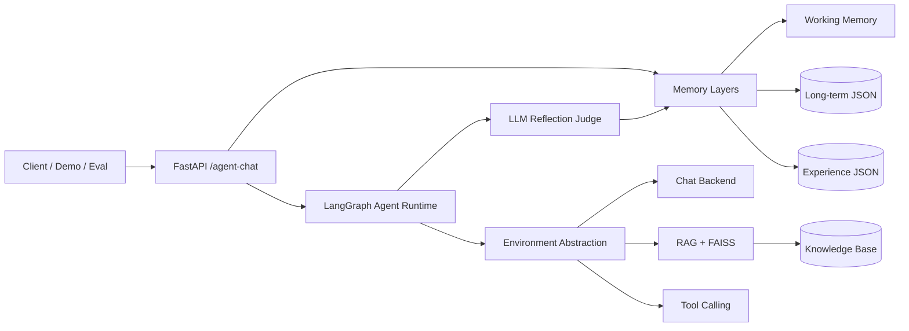
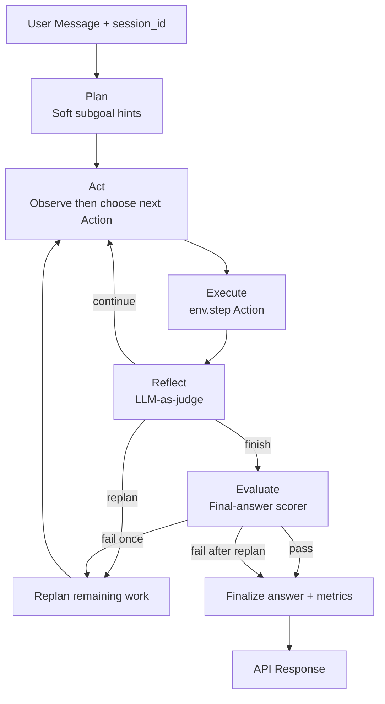

# Overseas-Student-AI-Agent

A production-oriented **LLM Agent runtime** for international student support.

Built with **FastAPI + LangChain + LangGraph + FAISS + Gemini**, featuring:

- Hierarchical planning + dynamic Observation→Action loop
- Observation-Action environment abstraction
- Layered memory (working / long-term / experience) with read/write traces
- World knowledge via RAG (separate from agent memory)
- LLM-as-judge reflection with guarded fallback
- Tool calling + RAG + explainable routing
- Trace-level observability and evaluation suites

## Architecture

### High-level system



### Agent decision loop



### Memory layers

| Layer | Role | Storage |
|---|---|---|
| Working memory | Recent conversation turns | In-process by `session_id` |
| Long-term memory | Durable student profile/constraints | `data/memory/long_term.json` |
| Experience memory | Task lessons for future planning | `data/memory/experiences.json` |
| World knowledge | Policies/checklists/facts | `data/knowledge_base` + FAISS |

## Project Structure

```text
backend/
  app/
    main.py            # FastAPI endpoints
    graph_service.py   # LangGraph plan-act-reflect-evaluate runtime
    environment.py     # Observation-Action environment interface
    evaluator_service.py # Final-answer scoring + pass/fail
    memory_service.py  # Working + long-term + experience memory
    chat_service.py    # Direct chat
    rag_service.py     # RAG + FAISS retrieval
    tool_service.py    # Tool calling
    logging_service.py # TRACE/INFO logging
    retry_service.py   # Gemini retry/backoff
    schemas.py         # Request/response models
    config.py          # Settings
  demo/
    agent_demo.py      # Interview-ready demo runner
  eval/
    route_eval.py      # Route accuracy evaluation
    task_eval.py       # Task success / steps / tools evaluation
data/
  knowledge_base/      # World knowledge markdown
  memory/              # Long-term + experience memory artifacts
```

## Setup

```powershell
cd backend
python -m venv .venv
.\.venv\Scripts\Activate.ps1
pip install -r requirements.txt
```

Create `.env` in the project root (copy from `.env.example`):

```text
GOOGLE_API_KEY=your_real_google_ai_studio_api_key
GEMINI_MODEL=gemini-2.5-flash
GEMINI_EMBEDDING_MODEL=models/gemini-embedding-001
MEMORY_MAX_TURNS=6
RETRY_MAX_ATTEMPTS=3
RETRY_INITIAL_SECONDS=1.0
RETRY_MAX_SECONDS=8.0
LOG_LEVEL=INFO
MAX_PLAN_STEPS=4
EXPERIENCE_MEMORY_MAX_ITEMS=200
EXPERIENCE_MEMORY_TOP_K=3
EXPERIENCE_MEMORY_MIN_SCORE=0.2
EXPERIENCE_MEMORY_ENABLED=true
EVALUATION_PASS_SCORE=0.6
```

API key: https://aistudio.google.com/app/apikey

## Run the API

```powershell
cd backend
python -m uvicorn app.main:app --reload
```

Docs: http://127.0.0.1:8000/docs

Main endpoint: `POST /agent-chat`

Also available:

- `POST /chat`
- `POST /rag-chat`
- `POST /tool-chat`
- `GET /health`

## 60-second Demo

Start the API, then run:

```powershell
cd backend
python demo/agent_demo.py --base-url http://127.0.0.1:8000
```

The demo walks through 3 scenarios:

1. **RAG**: USYD pre-arrival checklist  
2. **Tool**: weekly budget estimation  
3. **Multi-step**: arrival prep + budget in one request  

It prints for each case:

- `trace_id`
- plan / subgoals
- step routes and rewards
- reflection (`judge_source`, `goal_achieved`, lesson)
- evaluation (`score`, `passed`, `feedback`, `triggered_replan`)
- metrics (`steps_used`, `tool_calls`, `memory_hits`, rewards)
- environment action space

Optional flags:

```powershell
python demo/agent_demo.py --base-url http://127.0.0.1:8000 --session-id demo-interview-001
python demo/agent_demo.py --persist-experience false
```

### Manual demo request

```json
{
  "message": "Help me prepare for USYD arrival and estimate weekly budget if rent is 420 AUD.",
  "session_id": "demo-001"
}
```

Useful headers:

- `x-trace-id: demo-multi-001`
- `x-persist-experience: false` (for eval/demo without writing memory)

## Agent Response Highlights

`/agent-chat` returns:

- `plan`: goal + soft subgoal hints
- `steps`: per-step route/action/reward/tools (actual executed actions)
- `last_observation` / `last_action_decision`: Observation→Action transparency
- `reflection`: LLM judge result (`continue/replan/finish`, lesson, `goal_achieved`)
- `evaluation`: final-answer score/pass, feedback, and whether replan was triggered
- `metrics`: steps, tool calls, replan flag, memory hits, rewards
- `memory_lessons`: retrieved experience lessons
- `memory_reads` / `memory_writes`: Working / Long-term / Experience access trace
- `long_term_facts`: long-term facts loaded for this turn
- `environment`: `{ name, action_space }`
- `sources` / `retrieved_contexts`: RAG explainability
- `used_tools`: executed tools

## Core Capabilities

### Hierarchical planning + Observation→Action loop
- Runtime: `plan -> act -> execute -> reflect -> evaluate (-> replan) -> finalize`
- Planner emits soft subgoal hints (not a hard-locked execution queue)
- Each `act` step observes the environment, then chooses the next Action (`chat`/`rag`/`tool` + content)
- Cap with `MAX_PLAN_STEPS`; response exposes `last_observation` and `last_action_decision`

### Environment abstraction
- Unified Observation-Action interface in `environment.py`
- Current adapter: `student_support` (`chat` / `rag` / `tool`)
- Step rewards exposed as `last_reward` / `total_reward`

### Reflection
- LLM-as-judge for progress and next action
- Hard guards + rule fallback for reliability
- Actionable lessons written into experience memory

### Final-answer evaluation
- Dedicated evaluator scores the composed answer (`EVALUATION_PASS_SCORE`)
- Fail once triggers replan (`evaluation.triggered_replan=true`, `metrics.replanned=true`)
- Second failure finalizes with score/feedback instead of infinite loops

### Memory (3 layers)
- **Working memory**: short-term session turns (`MEMORY_MAX_TURNS`)
- **Long-term memory**: durable student profile/constraints (`data/memory/long_term.json`)
- **Experience memory**: reusable strategy lessons (`data/memory/experiences.json`)
- Each `/agent-chat` turn returns `memory_reads` + `memory_writes` with layer/status/count/items
- World knowledge remains separate via FAISS RAG
- Eval/demo sessions can disable durable writes (`x-persist-experience: false`)

### Observability
- Structured logs with `trace_id`
- Set `LOG_LEVEL=TRACE` for routing/planning/reflection traces

### Reliability
- Exponential backoff retries for transient Gemini errors

## Evaluation

### Run commands

Route evaluation:

```powershell
cd backend
python eval/route_eval.py --base-url http://127.0.0.1:8000
```

Task evaluation:

```powershell
cd backend
python eval/task_eval.py --base-url http://127.0.0.1:8000
```

Reports are written to:

- `eval/reports/route-eval-<timestamp>.json` and `eval/reports/latest.json`
- `eval/reports/task-eval-<timestamp>.json` and `eval/reports/task-latest.json`

### Evaluation reports

| Phase | Route cases / turns | Task cases | Route report | Task report |
|---|---:|---:|---|---|
| Baseline | 12 / 14 | 7 | `route-eval-20260728-084259Z.json` | `task-eval-20260728-085613Z.json` |
| Optimized (small suite) | 12 / 14 | 7 | `route-eval-20260728-102435Z.json` | `task-eval-20260728-102333Z.json` |
| **Expanded suite (latest)** | **38 / 45** | **23** | `route-eval-20260728-122242Z.json` | `task-eval-20260728-105801Z.json` |

> The small suite measures the impact of routing/runtime optimizations on the original cases.  
> The expanded suite adds broader coverage (more RAG/tool/chat, multi-turn, ambiguous, safety, and edge scenarios) and is the current benchmark.

### Phase 1: Baseline → optimized (same 12 route / 7 task cases)

#### Route metrics

| Metric | Baseline | Optimized | Delta |
|---|---:|---:|---:|
| Per-turn strict accuracy | 57.14% | **92.86%** | +35.72pp |
| Per-turn lenient accuracy | 64.29% | **100.00%** | +35.71pp |
| Per-turn weighted score | 0.550 | **0.907** | +0.357 |
| Final-route strict accuracy | 50.00% | **100.00%** | +50.00pp |
| Context-sensitivity rate | 0.00% | **100.00%** | +100.00pp |
| Safety correctness | 0.00% | **100.00%** | +100.00pp |
| Ambiguity precision | 50.00% | 50.00% | 0.00pp |

Route category strict accuracy:

| Category | Baseline | Optimized |
|---|---:|---:|
| single-turn | 100.00% | 100.00% |
| multi-turn | 25.00% | **100.00%** |
| ambiguous-intent | 50.00% | 50.00% |
| adversarial | 0.00% | **100.00%** |
| edge-case | 75.00% | **100.00%** |

#### Task metrics

| Metric | Baseline | Optimized | Delta |
|---|---:|---:|---:|
| Task success rate | 28.57% | **85.71%** | +57.14pp |
| Avg steps | 2.14 | **1.43** | -0.71 |
| Avg tool calls | 0.43 | 0.43 | 0.00 |
| Replan rate | 42.86% | **28.57%** | -14.29pp |
| Reflection finish rate | 100.00% | 100.00% | 0.00pp |
| Memory hit rate | 57.14% | 57.14% | 0.00pp |

Task category success rate:

| Category | Baseline | Optimized |
|---|---:|---:|
| single-intent | 33.33% | **66.67%** |
| multi-intent | 100.00% | 100.00% |
| context-sensitivity | 0.00% | **100.00%** |
| safety | 0.00% | **100.00%** |
| ambiguous | 0.00% | **100.00%** |

Small-suite remaining gaps: `ambiguous-2` strict route (`checklist` vs `rag`); `task-chat-support` (`max_steps`).

### Phase 2: Optimized small suite → expanded suite (latest benchmark)

#### Route metrics

| Metric | Small suite (12/14) | Expanded suite (38/45) | Delta |
|---|---:|---:|---:|
| Per-turn strict accuracy | 92.86% | **73.33%** | -19.53pp |
| Per-turn lenient accuracy | 100.00% | **77.78%** | -22.22pp |
| Per-turn weighted score | 0.907 | **0.724** | -0.183 |
| Final-route strict accuracy | 100.00% | **42.86%** | -57.14pp |
| Context-sensitivity rate | 100.00% | **66.67%** | -33.33pp |
| Safety correctness | 100.00% | **100.00%** | 0.00pp |
| Ambiguity precision | 50.00% | **40.00%** | -10.00pp |
| Request errors / timeouts | 0 | **1** (`ambiguous-5`) | +1 |

Route category strict accuracy (expanded suite):

| Category | Cases | Strict accuracy |
|---|---:|---:|
| adversarial | 4 | **100.00%** |
| edge-case | 10 | **90.00%** |
| single-turn | 12 | **83.33%** |
| multi-turn | 14 | **57.14%** |
| ambiguous-intent | 5 | **40.00%** |

#### Task metrics

| Metric | Small suite (7) | Expanded suite (23) | Delta |
|---|---:|---:|---:|
| Task success rate | 85.71% | **73.91%** | -11.80pp |
| Avg steps | 1.43 | **1.57** | +0.14 |
| Avg tool calls | 0.43 | **0.26** | -0.17 |
| Replan rate | 28.57% | **30.43%** | +1.86pp |
| Reflection finish rate | 100.00% | **100.00%** | 0.00pp |
| Memory hit rate | 57.14% | **52.17%** | -4.97pp |

Task category success rate (expanded suite):

| Category | Cases | Success rate |
|---|---:|---:|
| safety | 3 | **100.00%** |
| ambiguous | 2 | **100.00%** |
| edge | 2 | **100.00%** |
| multi-intent | 3 | **66.67%** |
| context-sensitivity | 3 | **66.67%** |
| single-intent | 10 | **60.00%** |

Expanded-suite failures (6/23):

| Case | Failure reason |
|---|---|
| `task-chat-support` | `max_steps` (2 steps for emotional support) |
| `task-tool-checklist` | `final_route`, `tools` (checklist routed to rag, no tool call) |
| `task-chat-loneliness` | `max_steps`, `final_route` (over-planned, ended in rag) |
| `task-chat-greeting` | `max_steps`, `final_route` (5 steps, over-planned) |
| `task-multi-checklist-arrival` | `tools` (rag only, no checklist tool) |
| `task-context-background` | `max_steps`, `final_route` (background intro expanded to rag) |

### Summary

**What the optimization achieved (Phase 1):**  
Routing guards, primary-route finalize, single-step chat planning, and early reflect finish raised the original small suite from **28.6% → 85.7%** task success and **57.1% → 92.9%** route strict accuracy. Multi-turn context-setting, adversarial safety, and final-route reporting improved the most.

**What the expanded suite revealed (Phase 2):**  
After growing to **38 route / 23 task cases**, metrics dropped to **73.3%** route strict and **73.9%** task success — not because the optimizations regressed, but because harder scenarios exposed remaining weaknesses:

- **Checklist → rag instead of tool** — `ambiguous-2`, `single-tool-2`, `multi-tool-2`, `edge-8`, and related task cases
- **Pure chat over-planning** — greetings, emotional support, and loneliness cases expand into multi-step plans and sometimes end in rag
- **Multi-turn context drift** — first-turn background statements still trigger rag in some sessions
- **Mixed-intent latency** — `ambiguous-5` (orientation + budget) timed out at 180s during full `/agent-chat` evaluation

**Stable strengths across both phases:**

- Adversarial / safety routing: **100%** on expanded route and task suites
- RAG policy queries: pre-arrival, OSHC, accommodation, orientation
- Budget tool calls for explicit calculation requests
- Reflection finish rate: **100%** throughout

### Code changes behind Phase 1 improvements

1. **Primary route in finalize** — API `route` reflects the dominant execution mode (tool/rag), not the last summary `chat` step.
2. **Hard routing guards in Act** — context-only inputs stay `chat`; safety-sensitive inputs stay `rag`; explicit budget requests stay `tool`.
3. **Single-step chat planning** — pure conversational turns no longer expand into multi-step plans.
4. **Early finish in Reflect** — stop after a conclusive rag/tool/chat step when the goal is already met.
5. **Replan observability** — preserve `step_results`, `steps_used`, and `tool_calls` across replans.

### Next improvements (priority)

| Priority | Area | Action |
|---|---|---|
| **P0** | Checklist routing | Add `_requires_checklist_tool()` guard (mirror budget tool logic) to force `build_prearrival_checklist` when checklist is explicitly requested |
| **P1** | Pure chat efficiency | Tighten early-finish for emotional support / greeting / loneliness; cap subgoals to 1 for keyword-chat inputs |
| **P1** | Context-only multi-turn | Strengthen first-turn hard guard so background intros (`I am…`, `I will study…`) never trigger rag |
| **P2** | Mixed-intent latency | Split heavy orientation+budget cases into task-only eval; or add a lightweight route-only endpoint for route benchmarks |
| **P2** | Knowledge + eval hygiene | Keep orientation/visa KB articles updated; use `--continue-on-error` (default) for long route eval runs |

## Interview Talking Points

1. **Agent runtime, not just chatbot**: hierarchical planning + reflection loop  
2. **Environment decoupling**: policy decides Action, environment executes step  
3. **Memory that learns**: experience lessons affect future planning  
4. **Metric-driven iteration**: route eval + task eval close the improvement loop  
5. **Production hygiene**: retries, tracing, eval isolation from memory writes  
