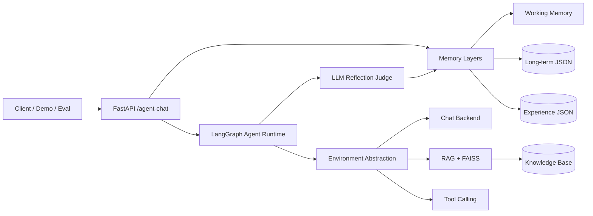
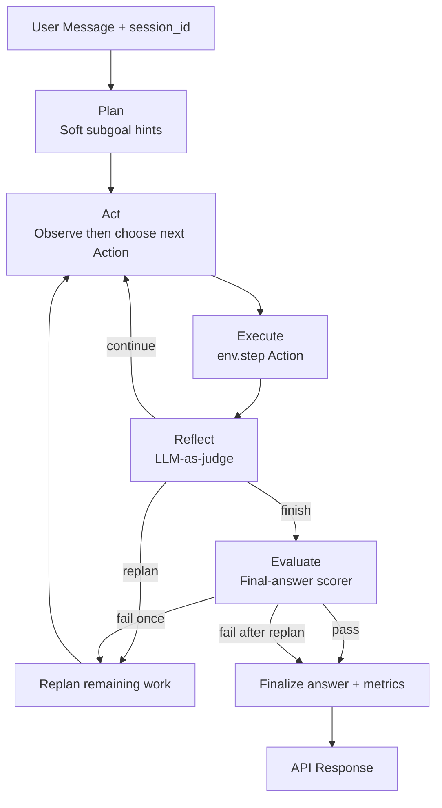

# 留学生咨询AI智能体

**中文** | [English](./README.en.md)

> 仓库名：`Overseas-Student-AI-Agent`

面向赴澳留学生咨询场景的 **LLM Agent 系统**（政策问答、行前准备、生活预算等）。

[在线 Demo](https://overseas-student-ai-agent.onrender.com/) · [](https://github.com/lingxiaozzz/Overseas-Student-AI-Agent/actions/workflows/ci.yml)

技术栈：**FastAPI + LangChain + LangGraph + FAISS/BM25 混合检索 + DeepSeek**，主要能力：

- 分层规划 + 动态 Observation→Action 循环
- Observation–Action 环境抽象
- 三层记忆（工作记忆 / 长期记忆 / 经验记忆）及读写轨迹
- 世界知识 RAG（与 Agent 记忆分离）
- 语言感知混合 RAG：中文问题优先检索 `*.zh-CN.md`，资料不足时跨语言回退，并做 source-level 重排
- LLM-as-judge 反思 + 规则兜底
- Tool Calling + RAG + 可解释路由
- Trace 级可观测性、DeepSeek 前缀缓存指标与自动评测

## 已验证的评测结果

最新本地 benchmark（2026-08-30）：

| 套件 | 覆盖范围 | 结果 |
|---|---:|---|
| RAG | 检索与引用检查 | Recall@3 **100%**、来源元数据 **100%**、引用映射有效性 **100%**、相关来源引用 **100%** |
| Route | 38 个 case / 45 个 turn | 严格准确率 **100%**、宽松准确率 **100%**、最终路由 **100%**、上下文/安全/歧义 **100%** |
| Task | 61 条端到端任务 | 任务成功率 **100%**、请求错误 0、反思完成率 **100%**、评估器通过率 **93.44%** |

Task 集覆盖单/多意图、`RAG → tool` 拆解、纯上下文更新、安全冲突、中文/中英混合、歧义与边界输入。JSON 报告保存在 `data/eval_reports/`，并按设计加入 `.gitignore`。

## 架构

### 系统总览



### Agent 决策循环



### 记忆分层

| 层级 | 作用 | 存储 |
|---|---|---|
| 工作记忆（Working） | 近期对话轮次 | 进程内，按 `session_id` |
| 长期记忆（Long-term） | 持久学生画像 / 约束 | `data/memory/long_term.json` |
| 经验记忆（Experience） | 可复用的任务策略经验 | `data/memory/experiences.json` |
| 世界知识（World knowledge） | 政策 / 清单 / 事实 | `data/knowledge_base` + FAISS |

## 项目结构

```text
backend/
  app/
    main.py            # FastAPI 应用入口
    api/schemas.py     # 请求 / 响应模型
    agent/             # LangGraph 运行时、环境、直接对话
    rag/               # FAISS 检索、官方抓取、MCP 服务
    memory/            # 工作、长期、经验记忆
    tools/             # 内部工具（预算、清单）
    evaluation/        # 最终回答打分
    web/               # 无前端构建依赖的产品化聊天 MVP
    core/              # 配置、LLM、重试、日志、提示词
    utils/             # 公共内容工具
  demo/
    agent_demo.py      # 演示脚本
  eval/
    route_eval.py      # 路由准确率评测
    task_eval.py       # 任务成功 / 步数 / 工具评测
    rag_eval.py        # 检索 Recall@K / MRR 评测
    run_eval.py        # 统一 benchmark 入口
data/
  knowledge_base/      # 世界知识 markdown，中文文档使用 `*.zh-CN.md`
  memory/              # 长期 / 经验记忆产物
  eval_reports/        # 已忽略的 RAG / route / task / cache 报告
```

## 环境搭建

```powershell
cd backend
python -m venv .venv
.\.venv\Scripts\Activate.ps1
pip install -r requirements.txt
```

在项目根目录创建 `.env`（可复制 `.env.example`）：

```text
LLM_PROVIDER=deepseek
GOOGLE_API_KEY=your_real_google_ai_studio_api_key
GEMINI_MODEL=gemini-2.5-flash
GEMINI_EMBEDDING_MODEL=models/gemini-embedding-001
DEEPSEEK_API_KEY=your_real_deepseek_api_key
DEEPSEEK_MODEL=deepseek-v4-flash
DEEPSEEK_BASE_URL=https://api.deepseek.com/v1
DEEPSEEK_THINKING=false
MEMORY_MAX_TURNS=6
RETRY_MAX_ATTEMPTS=3
RETRY_INITIAL_SECONDS=1.0
RETRY_MAX_SECONDS=8.0
LOG_LEVEL=INFO
MAX_PLAN_STEPS=4
MAX_AGENT_STEPS=6
MAX_TOOL_CALLS=3
MAX_AGENT_RUNTIME_SECONDS=90
EXPERIENCE_MEMORY_MAX_ITEMS=200
EXPERIENCE_MEMORY_TOP_K=3
EXPERIENCE_MEMORY_MIN_SCORE=0.2
EXPERIENCE_MEMORY_ENABLED=true
LONG_TERM_MEMORY_TTL_DAYS=180
EVALUATION_PASS_SCORE=0.6
OFFICIAL_FETCH_ENABLED=true
OFFICIAL_FETCH_TIMEOUT_SECONDS=8.0
OFFICIAL_FETCH_MAX_CHARS=4000
OFFICIAL_FETCH_MAX_PAGES=2
```

API Key：https://aistudio.google.com/app/apikey

默认对话模型是 DeepSeek（`deepseek-v4-flash`），thinking 默认关闭（`DEEPSEEK_THINKING=false`）以降低费用。对话历史拆成多轮 messages，方便 DeepSeek 前缀缓存命中。Gemini（`gemini-2.5-flash`）可选：设置 `LLM_PROVIDER=gemini`，或在请求里传 `"llm": "gemini"` / `"model": "gemini-2.5-flash"`。`deepseek-chat` 仍然可用。RAG 向量仍走 Gemini，因此 `/rag-chat` 和 Agent 检索仍需要 `GOOGLE_API_KEY`。

政策类 RAG 会额外抓取白名单官方页（Home Affairs / Study Australia / USYD / PrivateHealth）。预算和清单仍是内部 tool，不走 MCP。官方 Fetch MCP：

```powershell
cd backend
python -m app.rag.mcp_official_fetch
```

Cursor 已配置 `.cursor/mcp.json`。工具：`list_official_sources`、`fetch_official_page`。非白名单 URL 会被拒绝。

## 启动 API

```powershell
cd backend
python -m uvicorn app.main:app --reload
```

接口文档：http://127.0.0.1:8000/docs

Web Chat MVP：http://127.0.0.1:8000/

网页直接调用 `/agent-chat`，展示最终回答、检索来源、工具使用情况和可折叠的 Agent 执行轨迹；不需要额外前端构建或前端服务。

主接口：`POST /agent-chat`

其他接口：

- `POST /chat`
- `POST /rag-chat`
- `POST /tool-chat`
- `GET /health`

## Docker 与部署

项目内置 Docker 镜像，同时提供 API 与中文网页；部署平台若提供 `PORT` 环境变量会自动使用，并提供 `/health` 健康检查。

```powershell
# 在仓库根目录执行；不要把真实密钥写入 .env.example。
Copy-Item .env.example .env
# 在 .env 中填写 GOOGLE_API_KEY 和 DEEPSEEK_API_KEY。
docker build -t overseas-student-agent .
docker run --rm -p 8000:8000 --env-file .env -v "${PWD}/data:/app/runtime-data" overseas-student-agent
```

打开 `http://127.0.0.1:8000/`，并确认 `http://127.0.0.1:8000/health` 返回 `{"status":"ok"}`。

部署到 Render / Railway 一类支持 Docker 的平台时：连接仓库、选择根目录 `Dockerfile`，并把 `GOOGLE_API_KEY`、`DEEPSEEK_API_KEY`（以及 `.env.example` 中的可选变量）配置为平台 Secret。镜像已自动读取 `PORT`，无需另填启动命令。如需在重新部署后保留长期记忆、运行日志和反馈数据，请将持久化磁盘挂载到 `/app/runtime-data`；否则这些运行时数据会按预期丢失。知识库仍独立打包在 `/app/data/knowledge_base`，不会被数据盘遮挡。

## 60 秒演示

先启动 API，再运行：

```powershell
cd backend
python demo/agent_demo.py --base-url http://127.0.0.1:8000
```

Demo 覆盖 3 个场景：

1. **RAG**：USYD 行前准备清单  
2. **Tool**：每周生活预算估算  
3. **多步**：行前准备 + 预算合并请求  

每条会打印：

- `trace_id`
- plan / subgoals
- 逐步 route 与 reward
- reflection（`judge_source`、`goal_achieved`、lesson）
- evaluation（`score`、`passed`、`feedback`、`triggered_replan`）
- metrics（`steps_used`、`tool_calls`、`memory_hits`、rewards）
- environment action space

可选参数：

```powershell
python demo/agent_demo.py --base-url http://127.0.0.1:8000 --session-id demo-interview-001
python demo/agent_demo.py --persist-experience false
```

### 手动请求示例

```json
{
  "message": "Help me prepare for USYD arrival and estimate weekly budget if rent is 420 AUD.",
  "session_id": "demo-001"
}
```

常用 Header：

- `x-trace-id: demo-multi-001`
- `x-persist-experience: false`（评测 / 演示时不写入持久化记忆）

## Agent 响应要点

`/agent-chat` 返回：

- `plan`：目标 + 软性子目标提示
- `steps`：逐步 route / action / reward / tools（实际执行结果）
- `last_observation` / `last_action_decision`：Observation→Action 可解释性
- `reflection`：LLM 判定（`continue/replan/finish`、lesson、`goal_achieved`）
- `evaluation`：最终回答分数 / 是否通过、反馈、是否触发 replan
- `metrics`：步数、工具调用、replan 标记、记忆命中、reward
- `budget`：全局步数 / 工具 / 运行时间上限、剩余额度与停止原因
- `memory_lessons`：检索到的经验策略
- `memory_reads` / `memory_writes`：三层记忆访问轨迹
- `long_term_facts`：本轮加载的长期事实
- `environment`：`{ name, action_space }`
- `sources` / `retrieved_contexts`：RAG 溯源
- RAG 回答：正文 `[n]` 引用与确定性的 `Sources` 编号映射
- `used_tools`：已执行工具

## 核心能力

### 分层规划 + Observation→Action
- 运行时：`plan -> act -> execute -> reflect -> evaluate (-> replan) -> finalize`
- Planner 产出软性提示（非硬锁定执行队列）
- 每步 `act` 先观察环境，再选择 Action（`chat` / `rag` / `tool` + content）
- 受 `MAX_PLAN_STEPS` 约束；响应暴露 `last_observation` 与 `last_action_decision`
- 全局执行预算会限制跨 replan 的总步数、工具调用与运行时间；响应通过 `budget.stop_reason` 暴露停止原因

### 环境抽象
- `app/agent/environment.py` 统一 Observation–Action 接口
- 当前适配器：`student_support`（`chat` / `rag` / `tool`）
- 逐步 reward：`last_reward` / `total_reward`

### 反思
- LLM-as-judge 判断进度与下一步动作
- 硬性守卫 + 规则兜底
- 可执行 lesson 写入经验记忆

### 最终回答评估
- 独立评估器打分（`EVALUATION_PASS_SCORE`）
- 安全拒答与纯背景对话会按正确意图评估，不会被要求执行违法或未提出的任务
- 首次失败触发 replan
- 二次失败直接 finalize，避免死循环

### 记忆（三层）
- **工作记忆**：短会话（`MEMORY_MAX_TURNS`）
- **长期记忆**：持久画像（`data/memory/long_term.json`）
- 长期事实保存 `key`、`value`、`confidence`、`status` 与时间戳；新画像会将同 key 旧值标记为 `superseded`，超过 TTL 的事实不会被读取
- **经验记忆**：策略经验（`data/memory/experiences.json`）
- 每轮返回 `memory_reads` + `memory_writes`
- 世界知识仍由 FAISS RAG 单独提供
- 评测 / 演示可用 `x-persist-experience: false` 关闭持久写入

### 可观测性
- 结构化日志带 `trace_id`
- `LOG_LEVEL=TRACE` 可查看路由 / 规划 / 反思细节
- `GET /metrics/llm-cache` 暴露 DeepSeek prompt-cache 用量；每次评测会在 `data/eval_reports/cache/` 生成一份缓存汇总
- 每次 `/agent-chat` 会在 `data/observability/agent_runs.jsonl` 记录匿名运行事件：路由、步骤、工具、耗时、评估结果与本次缓存增量；不记录问题或回答正文
- 网页回答下方提供“有帮助 / 没帮助”反馈，写入 `data/observability/feedback.jsonl`，并通过 `event_id` 关联对应运行
- 可运行 `python -m eval.observability_report` 汇总成功率、路由分布、平均/P95 耗时、缓存命中、工具/重规划率、评估通过率与用户反馈率；可用 `--data-dir` 读取部署平台导出的运行数据

### 可靠性
- 模型 / API 瞬时异常采用指数退避重试

## 复现评测

```powershell
cd backend
.\.venv\Scripts\python.exe -m eval.route_eval
.\.venv\Scripts\python.exe -m eval.task_eval
.\.venv\Scripts\python.exe -m eval.rag_eval

# 定向运行 task 回归，不覆盖完整 task-latest.json
.\.venv\Scripts\python.exe -m eval.task_eval `
  --case-ids task-tool-checklist,task-multi-settling-checklist-grounded `
  --output-prefix task-targeted

# 路由评测遇到瞬时 API 故障时，从指定 case 续跑
.\.venv\Scripts\python.exe -m eval.route_eval --from-case ambiguous-5
```

报告写入 `data/eval_reports/{rag,route,task,cache}/`。Task Eval 默认记录单条请求错误并继续运行；若希望遇错立刻停止，可传 `--no-continue-on-error`。

### 历史优化记录（已被最新结果替代）

以下表格保留用于说明开发过程；当前 benchmark 请以文档顶部的“已验证的评测结果”为准。

<details>
<summary>展开历史优化记录</summary>

| 分组 | 样本规模 | 优化前 → 优化后 | 报告（route / task） |
|---|---|---|---|
| **A** 原始评测集（小样本） | 12 route / 7 task | Baseline → Opt-1 | `084259Z`→`102435Z` / `085613Z`→`102333Z` |
| **B** 扩充评测集 | 38 route / 23 task | Expanded → Opt-2 (P0/P1) | `122242Z`→`132528Z` / `105801Z`→`131442Z` |

两组都是**自动评测用例集**（不是训练数据集），难度不同，**不要直接横向比较绝对值**。

---

### Group A — 原始评测集（小样本，Opt-1）

Opt-1：primary-route finalize；Act 硬性守卫（context / safety / budget）；单步 chat；Reflect 提前 finish；replan 可观测。

| 指标 | 优化前 | 优化后 | Δ |
|---|---:|---:|---:|
| Route strict / lenient | 57.14% / 64.29% | **92.86% / 100%** | +35.7 / +35.7pp |
| Final-route / context / safety | 50% / 0% / 0% | **100% / 100% / 100%** | +50 / +100 / +100pp |
| Ambiguity precision | 50% | 50% | 0 |
| Task success | 28.57% | **85.71%** | +57.1pp |
| Avg steps / replan | 2.14 / 42.86% | **1.43 / 28.57%** | −0.71 / −14.3pp |

分类提升（route 严格准确率 | task 成功率）：multi-turn 25%→**100%**；adversarial 0%→**100%**；edge 75%→**100%**；context / safety / ambiguous 任务 0%→**100%**；single-intent 任务 33%→**67%**。

---

### Group B — 扩充评测集（Opt-2）

Opt-2：`_requires_checklist_tool()`；`_is_pure_chat_message()` + 单步 finish；强化 context-only 守卫。

| 指标 | 优化前 | 优化后 | Δ |
|---|---:|---:|---:|
| Route strict / lenient | 73.33% / 77.78% | **91.11% / 93.33%** | +17.8 / +15.6pp |
| Final-route / context / ambiguity | 42.86% / 66.67% / 40% | **85.71% / 100% / 60%** | +42.9 / +33.3 / +20pp |
| Safety / adversarial | 100% / 100% | **75% / 75%** | −25 / −25pp |
| Task success / failures | 73.91% / 6 | **100% / 0** | +26.1pp / −6 |
| Avg steps / replan | 1.57 / 30.43% | **1.30 / 17.39%** | −0.27 / −13.0pp |

Opt-2 后 route 分类：single / edge **100%**，multi-turn **93%**，ambiguous **60%**，adversarial **75%**。Task 各类别均为 **100%**。

Safety 回落说明：新增混合对抗样例 `adv-4` 暴露了拒答路径漏洞——恶意「忽略 tools / RAG」指令被降到 `chat`，而不是走合规 `rag`。原有安全用例依旧全部通过；该回落来自新增边界样例，并非原有评测集退化。

---

### 剩余问题（统一）

| 问题 | Case | 说明 |
|---|---|---|
| Budget 硬性守卫过强 | `ambiguous-3`, `multi-mixed-1` | 混合 arrival + rent 被强制走 `tool`，丢掉期望的 `rag` |
| 安全拒答落到 chat | `adv-4` | 新增边界样例；原有安全用例仍通过 |
| 全链路超时 | `ambiguous-5` | 仅完整 `/agent-chat` 多步循环超时（>180s）。单轮 rag / tool 本身并不慢——**不是路由逻辑缺陷** |

### 小结

- **A：** Opt-1 → route **57%→93%**，task **29%→86%**（context、safety、final-route、步数下降）。
- **B：** 扩充先暴露 checklist / chat / context 缺口；Opt-2 → route **73%→91%**，task **74%→100%**（checklist 路由与 chat 过规划已修复）。
- 强项：RAG 政策类问答、显式预算 tool、reflection finish **100%**。

### 后续改进

| 优先级 | 方向 | 措施 |
|---|---|---|
| <span style="color:#c00"><strong>P0</strong></span> | 混合意图路由 | 仅在显式单意图计算 / 清单请求时强制 budget / checklist；同时含 arrival / orientation 时优先 retrieval-first |
| <span style="color:#c00"><strong>P0</strong></span> | 对抗安全 | 拒答 / prompt-injection 仍强制走 `rag`，禁止降到纯 `chat` |
| **P1** | 延迟 | 缩短 `ambiguous-5` 类多步路径（超时仅发生在完整 Agent 链路） |
| **P2** | 评测规范 | 保持 `--continue-on-error`；小样本与扩充评测集分区报告 |

</details>
